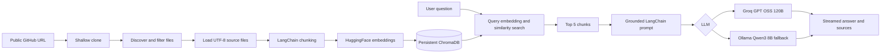

# CodebaseGPT

CodebaseGPT is a local full-stack RAG application for asking grounded questions about public GitHub repositories.

## Overview

CodebaseGPT clones a public GitHub repository, indexes supported source files, and lets you ask questions about the code through a React interface. Answers are generated from retrieved repository context rather than from the model's general knowledge, and the UI shows the source chunks used for each answer.

The application is designed as a straightforward learning project demonstrating repository ingestion, semantic retrieval, vector storage, prompt construction, and streamed LLM responses.

## Features

- Accepts public GitHub repository URLs.
- Reuses repositories that are already cloned and indexed locally.
- Filters supported source files and ignores common generated, dependency, build, and environment files.
- Splits files with LangChain's `RecursiveCharacterTextSplitter`.
- Generates normalized embeddings with `BAAI/bge-small-en-v1.5`.
- Stores repository chunks and metadata in persistent ChromaDB.
- Retrieves the five most similar chunks for each question.
- Uses Groq `openai/gpt-oss-120b` as the primary LLM when configured.
- Falls back to local Ollama `qwen3:8b` when Groq is unavailable or fails.
- Streams answers to the browser over Server-Sent Events.
- Displays Markdown, GitHub-Flavored Markdown tables, code blocks, and source references.
- Shows the model used for each assistant response.
- Includes light and dark themes with a responsive React UI.

## How It Works



## Architecture

- **Frontend:** React served by Vite. It accepts repository URLs, displays relevant files, submits questions, consumes SSE chunks, and renders Markdown responses.
- **Backend:** FastAPI exposes repository, chat, streaming, and health endpoints.
- **Ingestion pipeline:** Git clones the repository; the file loader filters and reads supported files; LangChain creates overlapping chunks; embeddings and metadata are stored in Chroma.
- **RAG pipeline:** A question is searched against repository-scoped Chroma data. The retrieved chunks and recent conversation are inserted into a grounded LangChain prompt.
- **Vector database:** ChromaDB persists embeddings locally and isolates searches by `repository_id`.
- **Generation:** Groq is the primary provider. Ollama with `qwen3:8b` is the local fallback. The selected model is returned with the answer.

## Tech Stack

| Technology | Purpose |
| --- | --- |
| Python 3.13 | Backend runtime |
| FastAPI | HTTP API and SSE streaming |
| React | Frontend UI |
| Vite | Frontend development and production build |
| LangChain | Text splitting, prompt construction, embeddings, vector store, and LLM integrations |
| ChromaDB | Persistent vector storage and similarity search |
| Sentence Transformers | Local embedding model runtime |
| `BAAI/bge-small-en-v1.5` | Embedding model |
| Groq | Primary hosted LLM provider |
| `openai/gpt-oss-120b` | Primary Groq model |
| Ollama | Local fallback LLM provider |
| `qwen3:8b` | Ollama fallback model |
| Git | Repository cloning |

## Project Structure

```text
CodeBaseGPT/
├── backend/
│   ├── app/
│   │   ├── api/
│   │   │   ├── chat.py             # Chat and SSE endpoints
│   │   │   └── repositories.py     # Repository endpoints
│   │   ├── core/config.py          # Environment-backed settings
│   │   ├── models/schemas.py       # Pydantic request/response models
│   │   └── services/
│   │       ├── chunker.py          # LangChain text splitting
│   │       ├── embeddings.py       # HuggingFace embeddings
│   │       ├── file_loader.py      # File discovery and loading
│   │       ├── github.py           # URL parsing and shallow cloning
│   │       ├── ingestion.py        # Ingestion coordinator
│   │       ├── llm.py              # Groq and Ollama generation
│   │       ├── rag.py              # Retrieval and prompt construction
│   │       └── vector_store.py     # Chroma operations
│   ├── tests/                      # Backend tests
│   ├── main.py                     # `uvicorn main:app` entrypoint
│   ├── requirements.txt
│   └── .env.example
├── frontend/
│   ├── src/
│   │   ├── components/             # Repository, chat, source, and file UI
│   │   ├── pages/Home.jsx          # Main application screen
│   │   └── services/api.js         # REST and SSE client
│   ├── package.json
│   └── vite.config.js
├── data/                            # Local repositories and Chroma data
├── .gitignore
└── README.md
```

## RAG Pipeline

1. **Repository ingestion:** The API validates a public GitHub URL and performs a depth-one clone.
2. **File filtering:** The loader supports `.py`, `.js`, `.jsx`, `.ts`, `.tsx`, `.java`, `.c`, `.cpp`, `.h`, `.hpp`, `.html`, `.css`, `.md`, and `.json`.
3. **Ignored content:** `.git`, `node_modules`, virtual environments, caches, build directories, lock files, `.env` files, and files larger than `MAX_FILE_SIZE` are skipped.
4. **Chunking:** LangChain's `RecursiveCharacterTextSplitter` uses a 2,000-character chunk size and 200-character overlap.
5. **Embedding generation:** `HuggingFaceEmbeddings` generates normalized vectors using `BAAI/bge-small-en-v1.5`.
6. **ChromaDB storage:** Chunks are stored with `repository_id`, relative file path, and chunk index metadata.
7. **Query embedding:** Chroma uses the same embedding integration for the question.
8. **Similarity search:** The query is filtered to the requested repository and retrieves the top five chunks.
9. **Context construction:** Retrieved chunks and recent conversation messages are inserted into a grounded LangChain prompt.
10. **LLM generation:** Groq is attempted first; Ollama is used as a fallback. Streaming uses the `/chat/stream` endpoint.
11. **Source attribution:** The response includes each retrieved file path, snippet, chunk index, similarity score, and the model used.

## Getting Started

### Prerequisites

- Python 3.13
- Node.js 18 or newer and npm
- Git on `PATH`
- Ollama installed and running for fallback generation
- Ollama model `qwen3:8b`
- A Groq API key if Groq generation is desired

GitHub repositories must be public and accessible through Git.

### Backend

From the repository root:

```powershell
cd backend
py -3.13 -m venv .venv
.\.venv\Scripts\Activate.ps1
python -m pip install -r requirements.txt
Copy-Item .env.example .env
uvicorn main:app --reload
```

On shells where `py -3.13` is unavailable, create the virtual environment with an installed Python 3.13 executable.

### Ollama fallback

Start Ollama, then pull the fallback model:

```powershell
ollama pull qwen3:8b
```

Ollama should be available at `http://localhost:11434` unless `OLLAMA_BASE_URL` is changed.

### Frontend

In a second terminal:

```powershell
cd frontend
npm install
npm run dev
```

Open the Vite URL shown in the terminal, normally `http://localhost:5173`.

The Vite development server proxies `/api` requests to the backend at `http://127.0.0.1:8000`.

### Tests and production build

```powershell
cd backend
.\.venv\Scripts\Activate.ps1
python -m pytest -q

cd ..\frontend
npm run build
```

## Environment Variables

Create `backend/.env` from `backend/.env.example` and set the Groq key yourself:

```env
GROQ_API_KEY=your_groq_api_key_here
GROQ_MODEL=openai/gpt-oss-120b
OLLAMA_BASE_URL=http://localhost:11434
OLLAMA_MODEL=qwen3:8b
CHROMA_PATH=.chroma_db
EMBEDDING_MODEL=BAAI/bge-small-en-v1.5
MAX_FILE_SIZE=1000000
```

Additional supported settings include:

```env
REPO_STORAGE_PATH=../data/repositories
```

If `GROQ_API_KEY` is empty, the application uses Ollama directly. Never commit `backend/.env` or any API key.

## Usage

1. Start the backend and frontend.
2. Enter a public GitHub repository URL such as `https://github.com/owner/repository`.
3. Select **Analyze repository** and wait for cloning and indexing to finish.
4. Ask a question in the chat panel.
5. Watch the response stream into the interface.
6. Review the rendered Markdown, model label, relevant files, and source snippets.

Submitting a repository that is already cloned and indexed locally returns immediately instead of repeating ingestion.

## API

| Method | Endpoint | Description |
| --- | --- | --- |
| `GET` | `/health` | Returns the service health status. |
| `POST` | `/repositories` | Clone and index a public GitHub repository, or reuse an existing local index. |
| `GET` | `/repositories/{repository_id}` | Return repository metadata stored during the current backend process. |
| `DELETE` | `/repositories/{repository_id}` | Delete the stored local clone and in-memory repository record. |
| `POST` | `/chat` | Return a complete RAG answer with sources and model name. |
| `POST` | `/chat/stream` | Stream answer chunks as Server-Sent Events, followed by sources and model metadata. |

### Create a repository

```http
POST /repositories
Content-Type: application/json

{
  "github_url": "https://github.com/owner/repository"
}
```

### Ask a question

```http
POST /chat
Content-Type: application/json

{
  "repository_id": "repo_owner_repository",
  "question": "How does authentication work?",
  "messages": [
    {
      "role": "user",
      "content": "Where is login implemented?"
    }
  ]
}
```

The response contains `answer`, `sources`, and `model`. The streaming endpoint emits `token`, `done`, and `error` SSE event types.

## Limitations

- Only public GitHub repositories are supported.
- Repository ingestion is synchronous and can take time for large repositories.
- Only the configured source extensions are indexed.
- Files larger than `MAX_FILE_SIZE` (1,000,000 bytes by default) are skipped.
- Files must be readable as UTF-8 text.
- Retrieval is limited to the five most similar chunks.
- The file tree shows files returned as sources, not every file in the repository.
- The repository registry is in memory and is lost when the backend process restarts, although Chroma data and cloned repositories remain on disk.
- The default clone is shallow and does not provide branch or commit selection.
- Groq requires a valid API key and network access; Ollama must be available for local fallback generation.
- There is no private repository authentication, reranking, hybrid search, or code execution.

## Future Improvements

- Add private repository authentication.
- Support branch, tag, and commit selection.
- Add repository refresh and update detection.
- Expose a complete repository file tree endpoint.
- Add code-aware chunking and optional reranking.
- Add hybrid lexical and semantic retrieval.
- Persist repository metadata across backend restarts.
- Add deployment configuration and hosted operation.

## Learning / Technical Concepts

This project demonstrates:

- Retrieval-augmented generation (RAG)
- Embedding generation and semantic similarity search
- Vector database usage with ChromaDB
- LangChain document splitting and prompt construction
- FastAPI API design and Server-Sent Events
- React state management and streamed UI updates
- GitHub repository ingestion and source attribution

## License

No license file is currently included in this repository.
